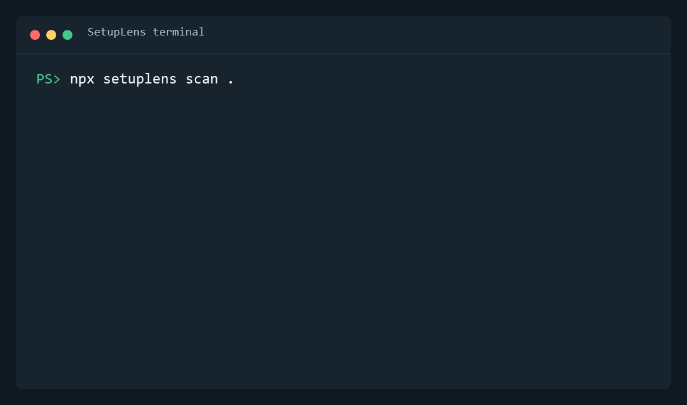
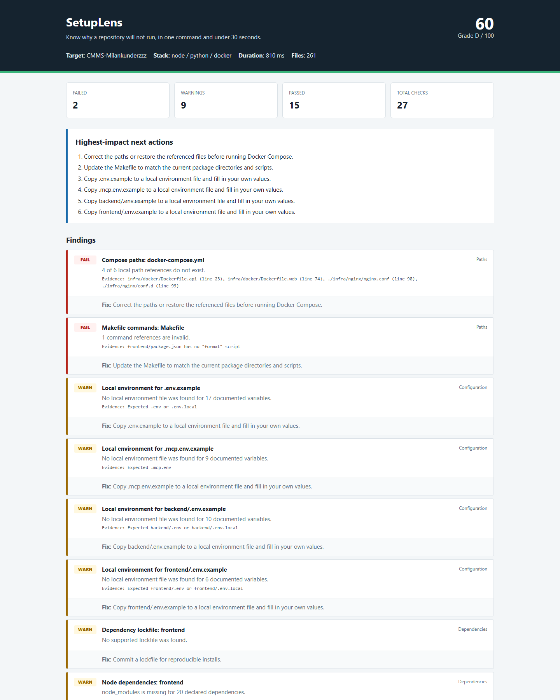

<div align="center">

# SetupLens

**一条命令，在 30 秒内告诉你一个仓库为什么跑不起来。**

[English](README.md) | [插件 API](docs/PLUGIN_API.md) | [示例报告](docs/demo-report.html)

</div>



SetupLens 是一个本地优先的仓库可运行性诊断工具。它会在开发者浪费数小时排查环境之前，找出缺失的运行时、未安装的依赖、不完整的环境变量、错误的 Docker Compose 路径、失效的 Makefile 命令、凭据风险和编辑器配置缺口。

## 一条命令体验

无需克隆、注册或上传代码：

```bash
npx --yes github:Milankunderzzz/SetupLens scan .
```

生成完全离线、可分享的 HTML 报告：

```bash
npx --yes github:Milankunderzzz/SetupLens scan . --format html --output setuplens-report.html
```

SetupLens 只读取本地文件和命令，不上传仓库内容、环境变量值或扫描结果。

## 真实量化结果

在 Windows 11、Intel i5-12500H、Node.js 24 环境下，对一个包含 Node.js、Python、Docker 和 261 个文件的真实 CMMS 项目执行 10 次扫描：

| 指标 | 结果 |
|---|---:|
| 10 次扫描中位数 | **764 ms** |
| 最快 / 最慢 | 721 ms / 869 ms |
| 检查项 | 27 |
| 结果 | 2 个失败、9 个警告、15 个通过 |
| 确认发现 | 4 个 Compose 错误路径、1 个缺失 npm 脚本 |
| 上传数据 | **0 字节** |



## 与其他产品的区别

SetupLens 不追求替代所有审计工具，只聚焦一个时刻：**开发者已经拿到代码，但项目在他的电脑上跑不起来。**

| 产品 | 主要解决的问题 | 本地运行环境 | 仓库规范 | 维护者分析 | Web 性能 | 离线 |
|---|---|:---:|:---:|:---:|:---:|:---:|
| **SetupLens** | 为什么这个仓库在这里跑不起来？ | **强** | 基础 | 无 | 无 | **是** |
| [Repo Doctor](https://github.com/JaaasperLiu/repo-doctor) | 仓库是否符合开源规范？ | 无 | **强，支持自动修复** | 无 | 无 | 是 |
| [GitVital](https://github.com/bugsNburgers/GitVital) | GitHub 项目是否健康活跃？ | 无 | 基于元数据 | **强** | 无 | 否 |
| [Lighthouse](https://github.com/GoogleChrome/lighthouse) | 已部署网页是否快速、可访问？ | 仅浏览器 | 无 | 无 | **强** | 是 |

### 我们的优势

- 能发现 GitHub 元数据看不到的本机环境和真实路径问题。
- 零运行时依赖、无需账号、无遥测、本地完成。
- 同一份扫描结果支持终端、JSON、HTML 和 GitHub Action。
- 核心功能聚焦，同时允许显式加载团队插件。

### 当前短板

- 仍处于早期阶段，规则数量少于成熟专项工具。
- 当前需要 Node.js 18.17 或更高版本启动。
- 目前提供修复建议，但不会自动修改项目文件。
- 不替代漏洞扫描、网页性能测试或长期维护者分析。

我们的方向是“确定性证据优先，AI 解释可选”。AI 应该解释一个已确认的错误路径，而不是凭空猜测错误。

## 输出与 CI

```bash
setuplens scan .
setuplens scan . --format json --output setuplens-report.json
setuplens scan . --format html --output setuplens-report.html
setuplens scan . --threshold 80
setuplens scan . --plugin ./examples/custom-plugin.mjs
```

## 路线图

- **0.1：** Node.js、Python、Docker、环境变量、路径、安全和仓库检查
- **0.2：** 深化 Java、Go、Rust，增加 SARIF 和规则策略
- **0.3：** 生成可审阅的修复计划与安全自动修复
- **0.4：** 签名独立二进制和精选插件注册表
- **后续：** 基于确定性结果的本地模型或自带模型解释

## 开发

```bash
git clone https://github.com/Milankunderzzz/SetupLens.git
cd SetupLens
npm ci
npm run check
npm test
node ./bin/setuplens.js scan .
```

扫描运行时只使用 Node.js 内置模块。开发依赖仅用于生成 README 演示 GIF。

## 许可证

[MIT](LICENSE)
